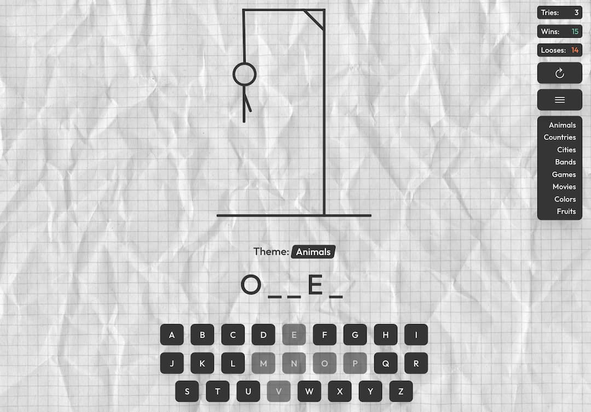

# Gallows Game

A classic word-guessing game where you try to uncover the hidden word before the stick figure is fully drawn.
Built with React & Vite.

## Features

- Randomly selected words for each game session.
- Intuitive user interface with buttons for guessing letters.
- Canvas-based animations for drawing the hangman.
- Restart button to reset the game and start over.
- Tracks used letters and disables them after selection.
- Game stats that displays tryings, wins and looses.
- Menu button that allows to select a particular category.

## Technologies

- **Frontend library:** React ^18
- **Languages:** JavaScript
- **Animation library:** Motion
- **Store library:** Zustand
- **Build tool:** Vite

## Installation

Follow these steps to set up and run the project locally:

1. Clone the Repository
   git clone https://github.com/njordulv/gallows.git
   cd gallows

2. Install Dependencies
   Ensure you have Node.js installed, then run:
   npm install

3. Run the Application
   Start the development server:
   npm run dev

4. Build for Production
   To create an optimized build for deployment:
   npm run build

The production-ready files will be in the build/ directory.

## How to Play

1. A random word is selected and displayed as underscores (\_).
2. Guess letters by clicking the buttons.
   • Correct guesses reveal the letter(s) in the word.
   • Incorrect guesses add a part to the hangman figure.
3. You have 7 incorrect guesses before the game ends.
4. Use the Restart button to reset the game and try again.

## Screenshot

## License

This project is licensed under the [MIT License](LICENSE).

This project was bootstrapped with [Vite](https://vite.dev/).
